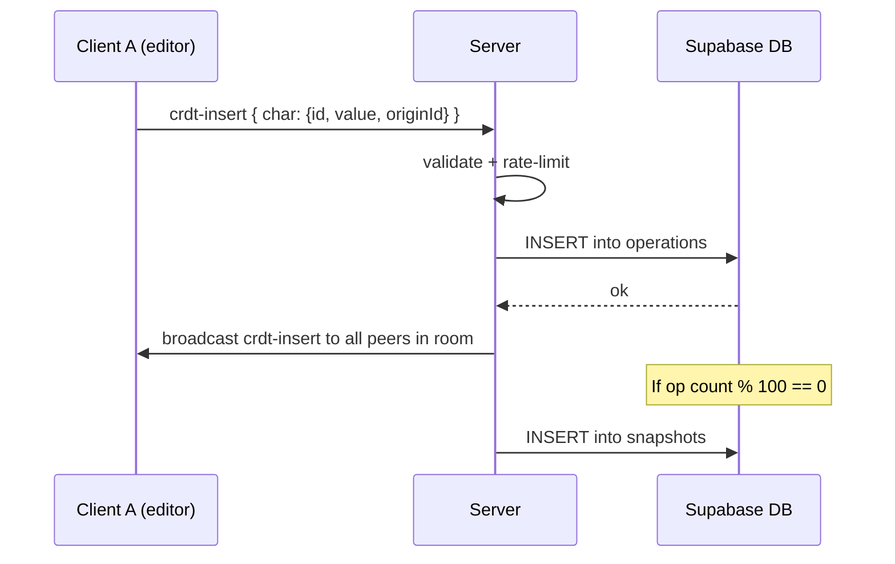
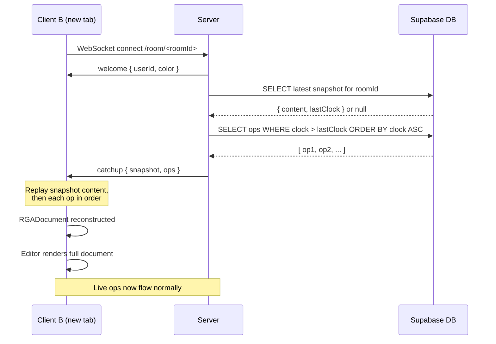
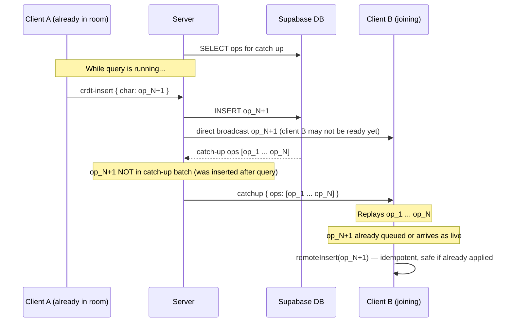

# Data Flow: Week 4 — Persistence & Catch-up

Shows how data moves through the system for the two primary Week 4 flows.

---

## Flow 1: Op Persistence (Happy Path)

How a keystroke travels from the editor to durable storage and to all peers.

---

## Flow 2: New Client Catch-up

How a brand-new client gets the full document state on joining a room.

---

## Flow 3: Catch-up / Live-stream Boundary

Race condition: a live op arrives at the server while catch-up is being assembled.

**Key insight**: CRDT idempotency (`remoteInsert` silently ignores duplicate IDs) makes this race safe without additional synchronization. No buffering or sequence numbering required.
