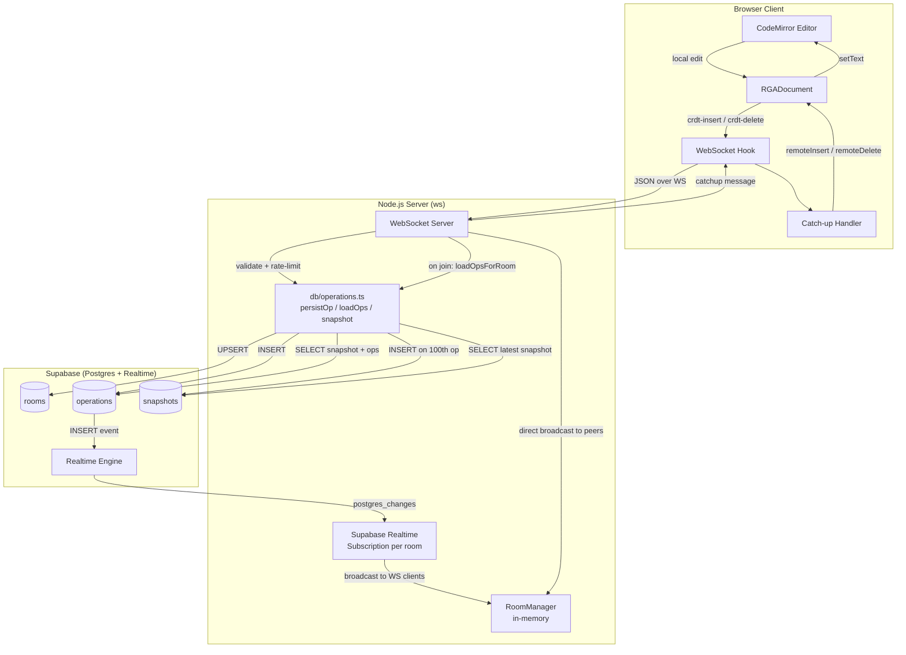

# System Architecture: Week 4 — Supabase Persistence

How the system components fit together after adding persistence.

## Component Responsibilities

| Component | Responsibility |
|-----------|---------------|
| `RGADocument` | CRDT state; unchanged by Week 4 |
| `useCRDT` hook | Local→op, remote op→editor; gains `catchup` message handling |
| `db/supabase.ts` | Supabase client singleton (service role) |
| `db/operations.ts` | All DB reads and writes; isolated from transport logic |
| `RoomManager` | WebSocket client registry; gains op count tracking |
| Supabase Realtime | Cross-instance op fan-out (toggled by env var) |

## Deployment Targets

- **Local dev**: Node.js `tsx watch`, Supabase local dev or cloud free tier
- **Production** (Week 5): Railway (server) + Vercel (client) + Supabase cloud
