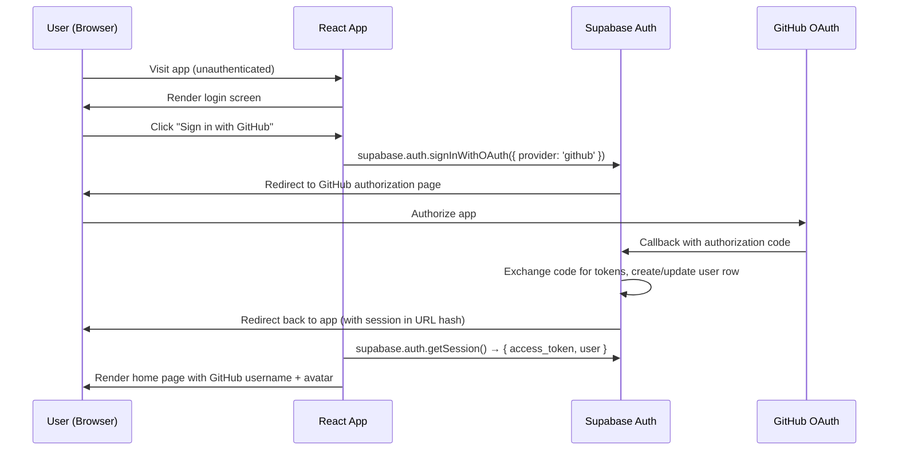
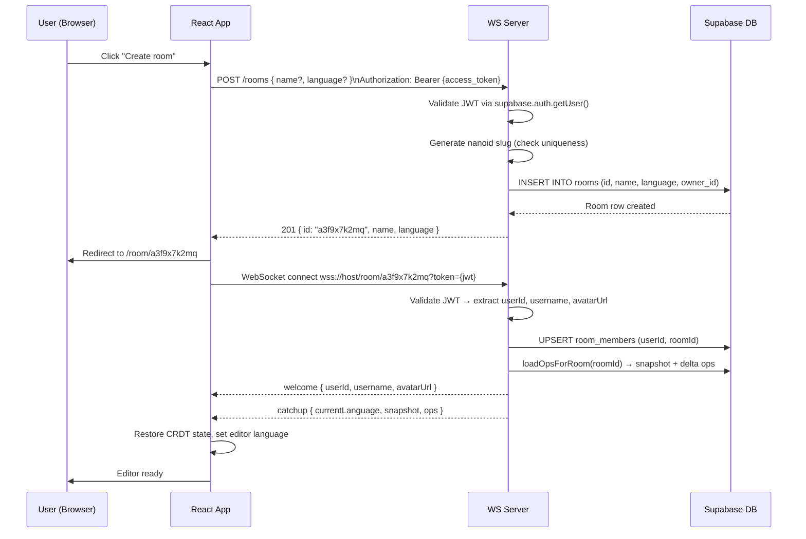
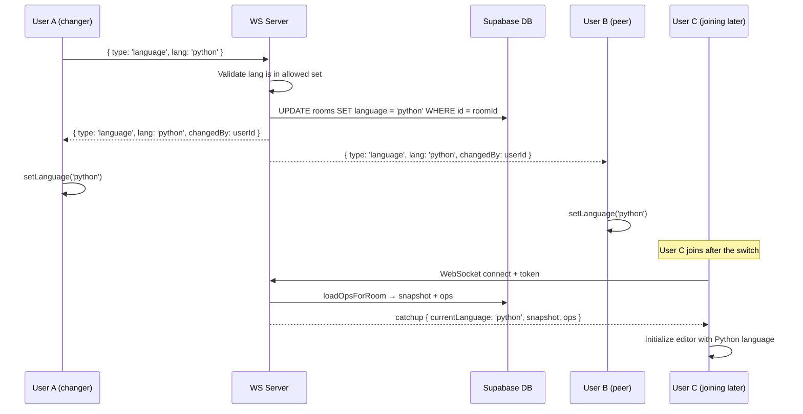
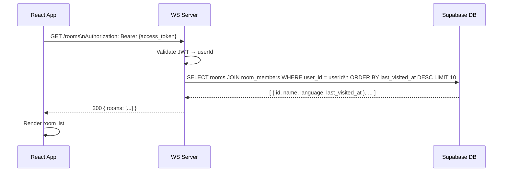

# Data Flow: Week 5 — Auth, Rooms, and Polished UX

**Feature**: [spec.md](../spec.md)
**Branch**: `005-week-auth-rooms`
**Created**: 2026-07-22

---

## Data Flow 1: GitHub OAuth Login

---

## Data Flow 2: Create Room and Connect

---

## Data Flow 3: Language Switch

---

## Data Flow 4: Home Page — Recent Rooms

