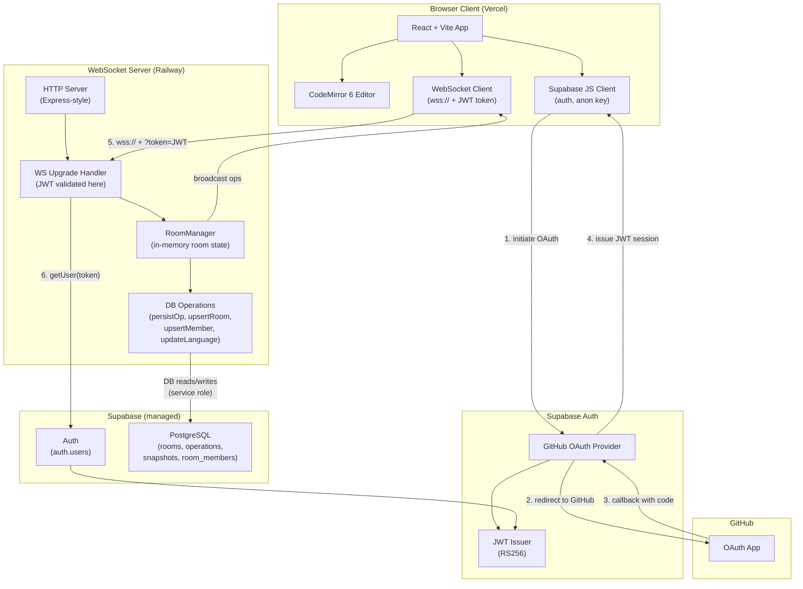

# System Architecture: Week 5 — Auth, Rooms, and Polished UX

**Feature**: [spec.md](../spec.md)
**Branch**: `005-week-auth-rooms`
**Created**: 2026-07-22

---

## System Architecture Diagram

**Deployment topology**:
- Frontend: Vercel (static + CDN, auto HTTPS, GitHub push-to-deploy)
- WebSocket server: Railway (persistent Node.js container, WSS via Railway's proxy)
- Database + Auth: Supabase (managed Postgres + Auth, no separate deployment)

---

## What's New in Week 5

| Component | Week 4 State | Week 5 Change |
|-----------|-------------|----------------|
| WebSocket URL | `ws://localhost:3001/room/{id}` | `wss://{host}/room/{id}?token={jwt}` |
| Identity | Anonymous server-assigned UUID | Supabase user ID + GitHub username + avatar |
| Room creation | Auto-created on first WS connect | Explicit `POST /rooms` before connecting |
| Language | Hardcoded JavaScript | Per-room, broadcast live, persisted in DB |
| Deployment | localhost only | Public HTTPS/WSS on Vercel + Railway |
